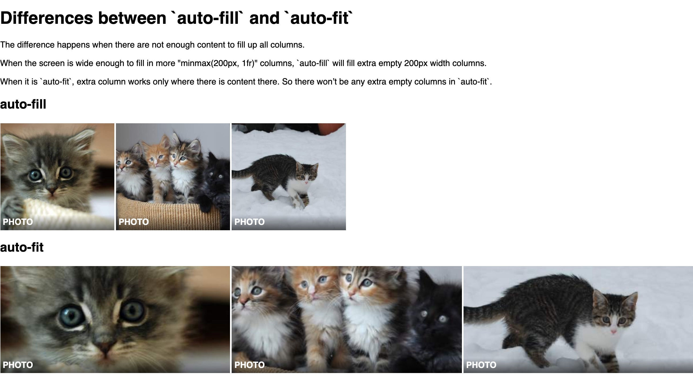

CSS Block Grid by using `grid`.


```css
.container {
  display: grid;
  grid-template-columns: repeat(auto-fill, minmax(200px, 1fr));
  grid-column-gap: 3px;
  grid-row-gap: 3px;
}
```


The `minimal(200px, 1fr)` means every grid column has minimal 200px width. If there are more spaces, they all have equal width because of the `1fr` fraction setting. The `repeat` and `auto-fill` means repeating the column to fill in as many columns as possible according to the `minmax(200px, 1fr)` requirement.


## Demo

<iframe src="https://player.vimeo.com/video/249617708?color=fad749&byline=0&portrait=0" width="100%" height="511" frameborder="0" allow="autoplay; fullscreen" allowfullscreen></iframe>


## Differences between `auto-fill` and `auto-fit`


The difference happens when there are not enough content to fill up all columns.

When the screen is wide enough to fill in more "minmax(200px, 1fr)" columns, `auto-fill` will fill extra empty 200px width columns.

When it is `auto-fit`, extra column works only where there is content there. So there won’t be any extra empty columns in auto-fit.




## Demo

Checkout the following codepen demo for their differences.

[https://codepen.io/makzan/pen/dJZXPp?editors=1100](https://codepen.io/makzan/pen/dJZXPp?editors=1100)

1. Try resizing the browser.
1. Try adding more photos into the container.
1. Try changing the minmax value.


<iframe height="853" style="width: 100%;" scrolling="no" title="Differences between auto-fill and auto-fit" src="https://codepen.io/makzan/embed/dJZXPp?height=853&theme-id=light&default-tab=result" frameborder="no" allowtransparency="true" allowfullscreen="true">
  See the Pen <a href='https://codepen.io/makzan/pen/dJZXPp'>Differences between auto-fill and auto-fit</a> by Thomas Seng Hin Mak
  (<a href='https://codepen.io/makzan'>@makzan</a>) on <a href='https://codepen.io'>CodePen</a>.
</iframe>