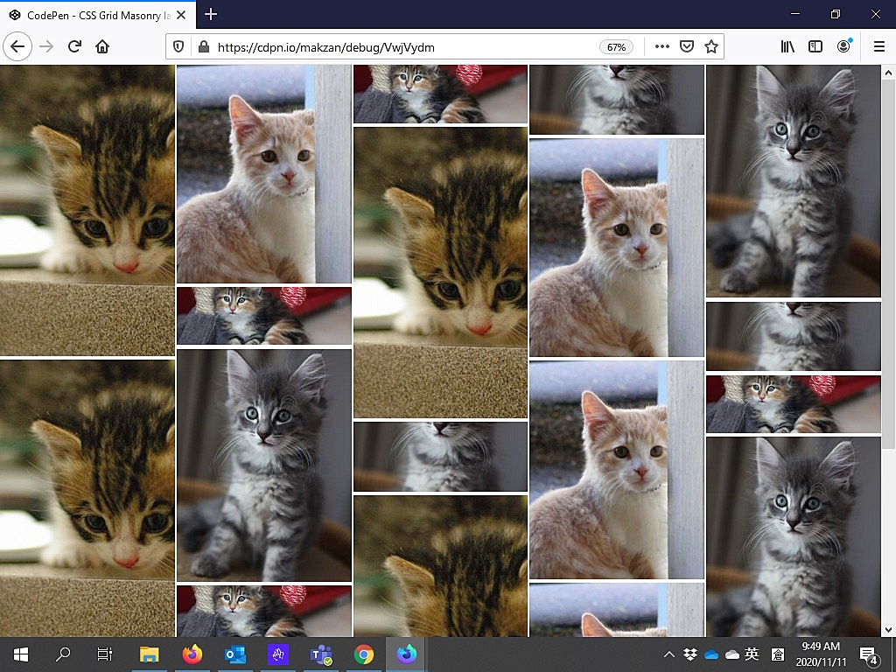

CSS:

```css
ul.block-grid {
  display: grid;
  grid-template-columns: repeat(auto-fill, minmax(250px, 1fr));    
  grid-gap: 3px;
}
@supports (grid-template-rows: masonry) {
  ul.block-grid {
    grid-template-rows: masonry;
  }  
}
```

HTML:

```html
<ul class="block-grid">
  <li>
    
  </li>
  <!-- More placeholder images -->
  <li>
    
  </li>
</ul>
```

Currently it is supported in Firefox via `layout.css.grid-template-masonry-value.enabled`.


Demo:

[https://codepen.io/makzan/pen/VwjVydm](https://codepen.io/makzan/pen/VwjVydm)

<iframe height="922" style="width: 100%;" scrolling="no" title="CSS Grid Masonry layout example" src="https://codepen.io/makzan/embed/VwjVydm?height=922&theme-id=light&default-tab=result" frameborder="no" loading="lazy" allowtransparency="true" allowfullscreen="true">
  See the Pen <a href='https://codepen.io/makzan/pen/VwjVydm'>CSS Grid Masonry layout example</a> by Thomas Seng Hin Mak
  (<a href='https://codepen.io/makzan'>@makzan</a>) on <a href='https://codepen.io'>CodePen</a>.
</iframe>